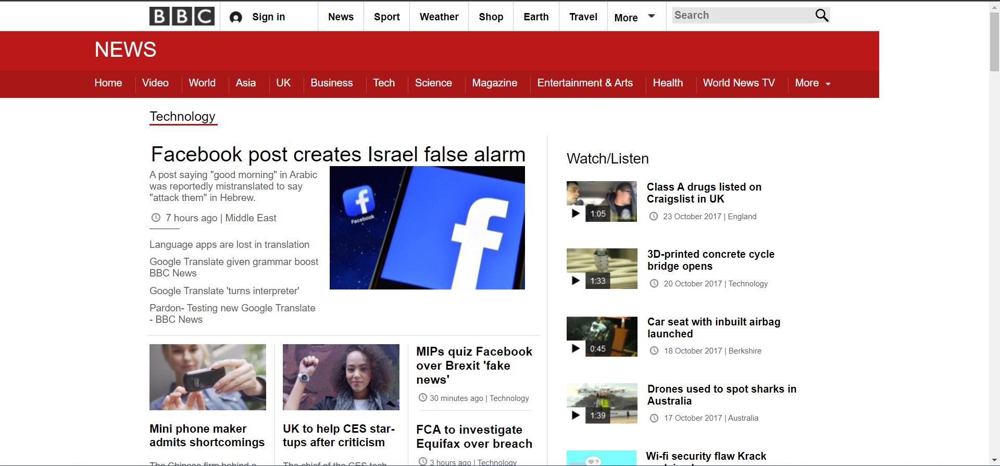
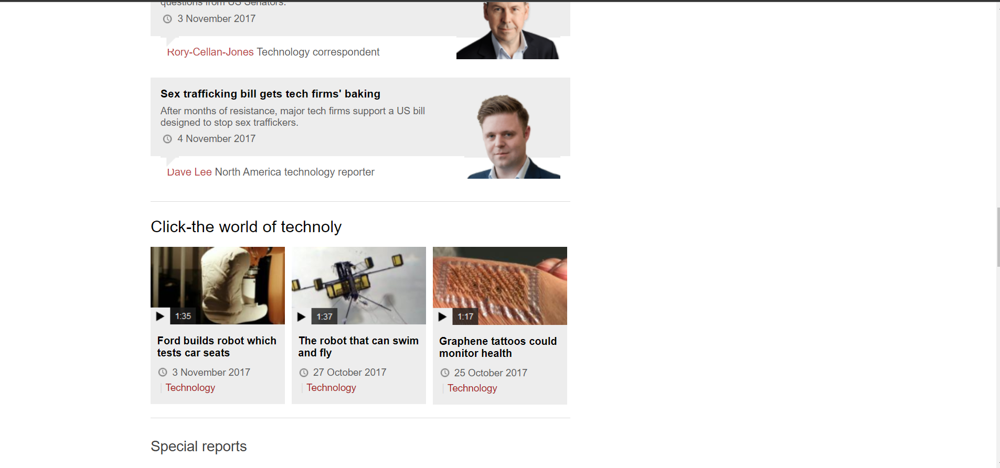
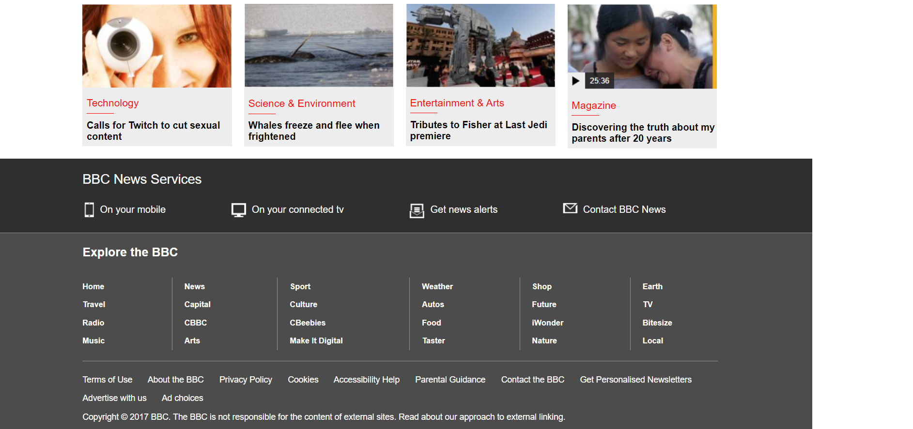

# BBC-News-Website-Clone

The BBC news website clone is a project created using HTML5, CSS3 with the aim of replicating the appearance and functionality of the BBC News website. 
The clone includes features such as a responsive layout that adapts to different screen sizes, a navigation bar with drop-down menus, and a news feed with articles 
displayed in a card format. The project is hosted on GitHub and can be accessed by anyone who wants to view or contribute to it. Overall, the BBC news website clone is 
an excellent example of using web development tools to recreate a popular and informative news website.

# Link

[Click here](https://sahil0029.github.io/BBC-News-Website-Clone/) to see live demo.

# Languages Used 

    1. HTML5
    2. CSS3
    
# Images

